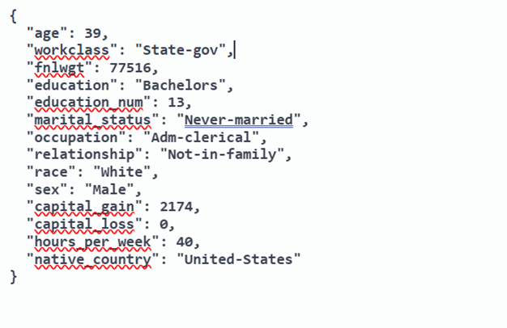
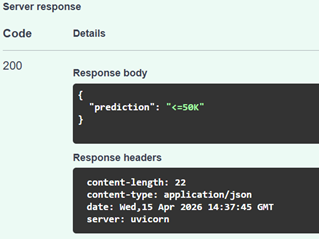

# Automated ML Pipelines & Model Serving

## Dataset
I used the UCI Adult dataset to predict whether income exceeds $50K.

## Files
- discovery.py: compares PyCaret and manual scikit-learn workflows
- main.py: FastAPI app serving the trained PyCaret model
- report.docx: screenshots of results

## How to Run
1. Install packages
2. Run discovery.py
3. Run uvicorn main:app --reload
4. Open link/docs

## Sample API Input

## Sample API Output

## Best Model
Light Gradient Boosting Machine had highest accuracy because it is able 
to model complex relationships as it builds relationship trees sequentially.